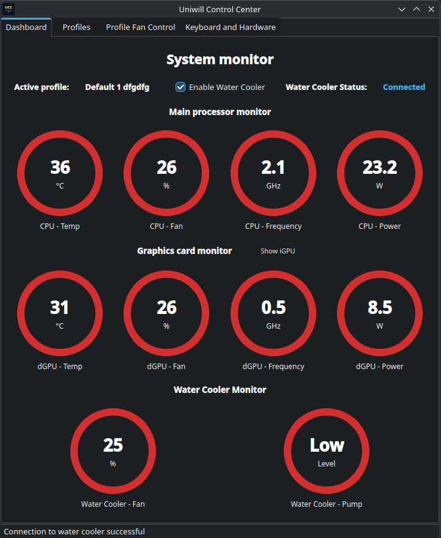
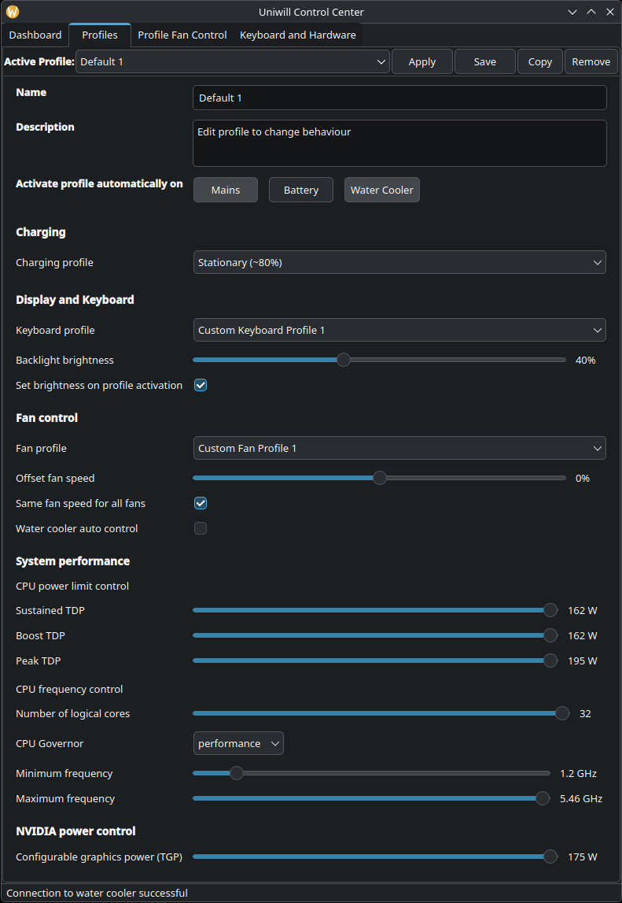
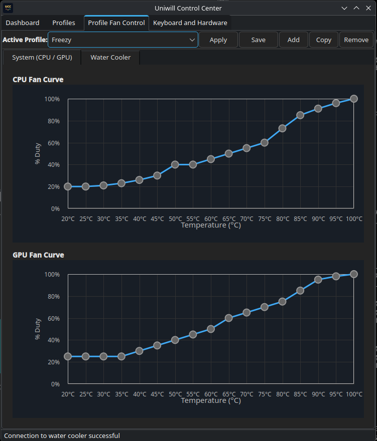
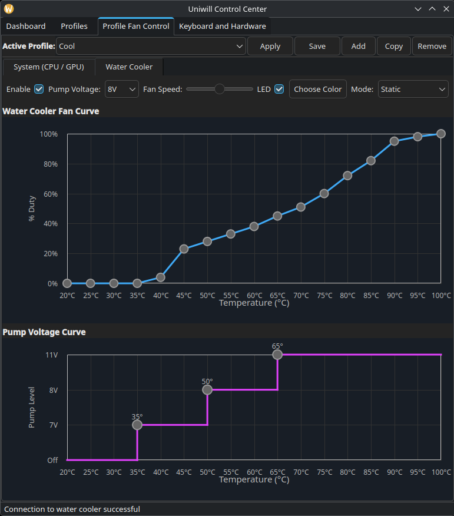
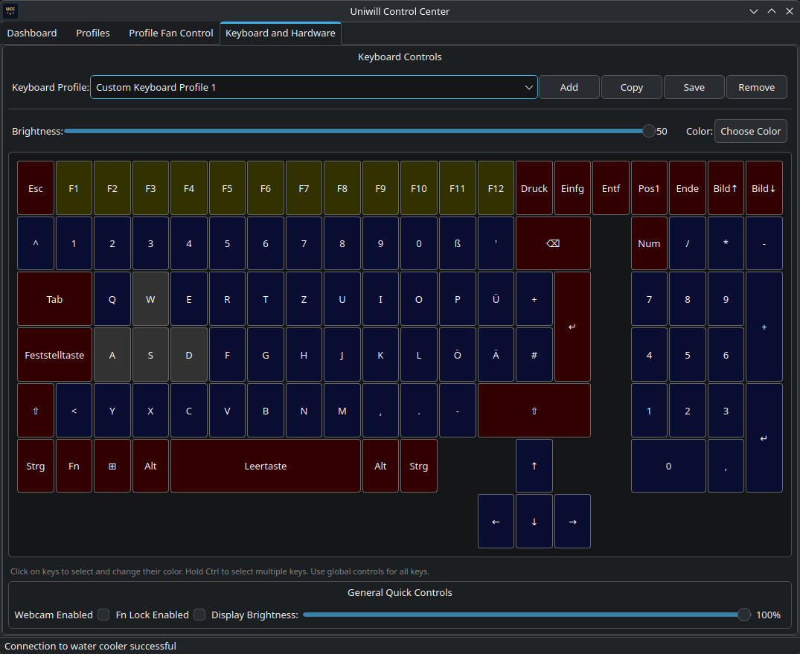

# WARNING: This project is very experimental and it has only been tested on an XMG Neo 16 A25, but there is no guarantee that it will even work on that properly. Do NOT yet try it, especially on other systems, do NOT use in production or on important systems — data loss, hardware misconfiguration, even damage may occur. Testing at your own risk.

# Uniwill Control Center (UCC)

> **Note**: This repository has been migrated from `ucc.eski` to `ucc`. See [MIGRATION_GUIDE.md](MIGRATION_GUIDE.md) for details.

Modern Qt6/KDE C++20 application suite for Uniwill laptop control.

## Components

- **Tuxedo IO**: IO access class taken from Tuxedo Control Center
- **libucc-dbus**: Shared library for communicating with uccd daemon via DBus
- **ucc-gui**: Main GUI application with QML interface
- **ucc-tray**: System tray applet for quick access (not yet available) 
- **ucc-widgets**: Plasma desktop widgets (system monitor, profile switcher) (not yet available) 

## Features

- Profile management (view, create, switch profiles)
- Real-time system monitoring (CPU, GPU, fan speeds)
- Power management
- Hardware control through uccd daemon

## Dependencies

### Build Requirements
- CMake >= 3.20
- GCC with C++20 support
- Qt6 (Core, Gui, Widgets, Qml, Quick, QuickControls2)
- KDE Frameworks 6
- sdbus-c++ >= 2.0

### Runtime Requirements
- Qt6 runtime libraries
- KDE Plasma (for widgets)
- tuxedo-drivers (kernel/user drivers required for hardware control)

## Building

```bash
mkdir build
cd build
cmake .. -DCMAKE_BUILD_TYPE=RelWithDebInfo
cmake --build .
sudo cmake --install .
```

## Building packages

To produce distribution packages (RPMs) locally you can use the project's
packaging helpers. On a Fedora/RHEL-style environment:

```bash
# clean previous artifacts
make distclean

# build SRPM and RPM (requires rpmbuild and packaging dependencies)
make srpm
make rpm

# Alternatively, a local-build script is provided:
./build-local.sh
```

Note: packaging may require additional host tools (`rpmbuild`, `cmake`,
`ninja`, etc.) and correct distro-specific setup. See the `INSTALL_LOCAL.md`
and packaging files for more details.

### Build Options

- `BUILD_GUI=ON/OFF` - Build main GUI application (default: ON)
- `BUILD_TRAY=ON/OFF` - Build system tray applet (default: ON)
- `BUILD_WIDGETS=ON/OFF` - Build Plasma widgets (default: ON)

Example:
```bash
cmake .. -DBUILD_WIDGETS=OFF  # Skip widget building
```

### Directory Structure

The project uses a clean separation of headers and sources:
- `inc/` directories contain header files (.hpp)
- `src/` directories contain source files (.cpp)
- Third-party code is in `3rdparty/` subdirectories

## Running

### Main Application
```bash
ucc-gui
```

### System Tray
```bash
ucc-tray
```

The tray applet can be added to autostart via the desktop file:
`~/.config/autostart/ucc-tray.desktop`

### Plasma Widgets
After installation, widgets can be added through Plasma's widget manager:
- Right-click on desktop → Add Widgets
- Search for "UCC System Monitor" or "UCC Profile Switcher"

## Architecture

```
┌─────────────┐     ┌─────────────┐     ┌─────────────┐
│   ucc-gui   │────▶│ libucc-dbus │────▶│   uccd      │
└─────────────┘     └─────────────┘     └─────────────┘
                            ▲
                            │
┌─────────────┐             │
│  ucc-tray   │─────────────┤
└─────────────┘             │
                            │
┌─────────────┐             │
│ ucc-widgets │─────────────┘
└─────────────┘
```

All components communicate with the uccd daemon through the shared libucc-dbus library.

## License

GPL-3.0-or-later

## Screenshots











